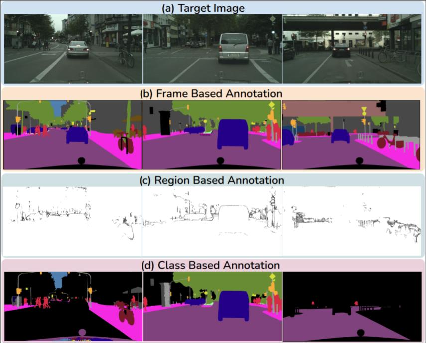

# Code to Select Contextually Diverse Class (WACV 2023)
This is the code accompanying the paper [Reducing Annotation Effort by Identifying and Labeling Contextually Diverse Classes for Semantic Segmentation Under Domain Shift](https://openaccess.thecvf.com/content/WACV2023/html/Agarwal_Reducing_Annotation_Effort_by_Identifying_and_Labeling_Contextually_Diverse_Classes_WACV_2023_paper.html) published in IEEE/CVF Winter Conference on Applications of Computer Vision (WACV), 2023.

## Contextual Class Selection


## Dataset
Download the [Cityscapes](https://www.cityscapes-dataset.com/#download) dataset. 

## Usage
Clone the repo:
```
git clone https://github.com/sharat29ag/contextual_class.git
```
Download :

[resent weight](https://drive.google.com/file/d/14dsAeHzFH8peXk7peU8VzX1BgKHPNcZP/view?usp=share_link)

[sample pretrained_weight](https://drive.google.com/file/d/1_I9Hbd-XFi--YCEI80MGh_pyFX-U6J0M/view?usp=share_link)


## Steps
1. Use any selection technique to select image ids from the unlabeled pool. CDAL_selection.txt is a sample selection using CDAL technique.
2. Save features using pretrained model for the already annotated images. 
```
python savefeat_anchor_based.py
```
3. Create class represetative anchors using the labeled pool. 
```
python create_anchors.py --file<path to labeled image ids text file> --features<path to features from step 2>
```
4. For anchor based annotation to annotate contextually diverse classes on the selected images of unlabeled pool using class representative anchors extracted from the labeled pool. 
```
python anchor_based_annotation.py
```
Results are saved in : anchor_based_annotation/Cityscapes(gtFine_labeldIds) and anchor_based_annotation_color(for color samples)
## Citation
If using this code, parts of it, or developments from it, please cite our paper:
```
@inproceedings{agarwal2023reducing,
  title={Reducing Annotation Effort by Identifying and Labeling Contextually Diverse Classes for Semantic Segmentation Under Domain Shift},
  author={Agarwal, Sharat and Anand, Saket and Arora, Chetan},
  booktitle={Proceedings of the IEEE/CVF Winter Conference on Applications of Computer Vision},
  pages={5904--5913},
  year={2023}
}
```
## Acknowledgements
CDAL selection [CDAL](https://github.com/KaiyangZhou/pytorch-vsumm-reinforce)

Segmentation training [MADA](https://github.com/munanning/MADA) 

## Contact
If there are any questions or concerns feel free to send a message at sharata@iiitd.ac.in
